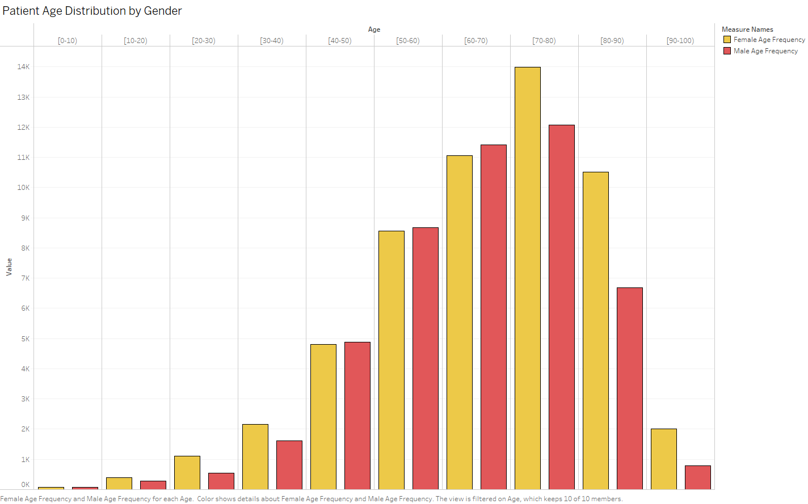
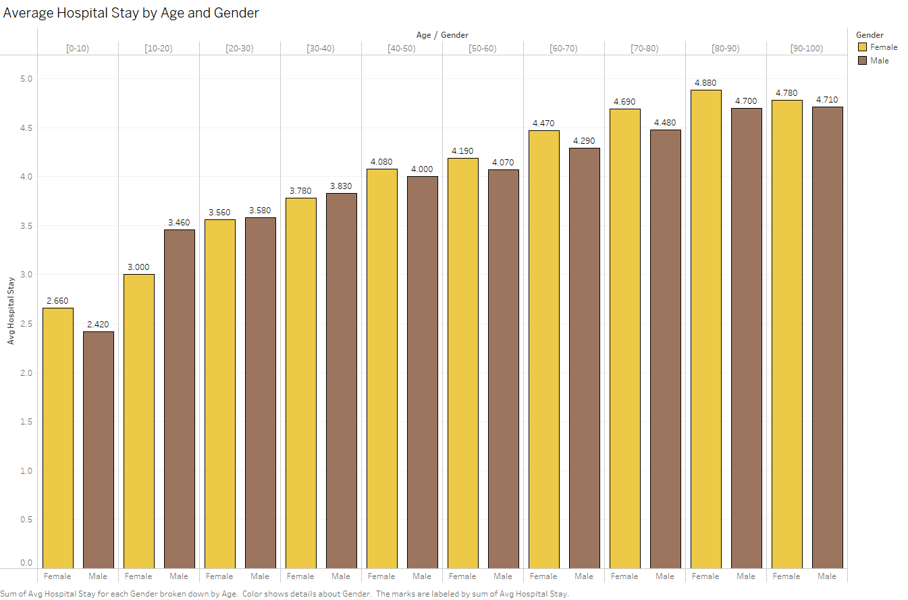

# Analysis of Data for Diabetes patients - 130-US Hospitals for Years 1999-2008

## Project Summary
This project explores the Diabetes Hospital Readmission dataset using SQL for analysis and Tableau for visualisation. 
The aim is to extract real-world, actionable insights and showcase technical skills in data cleaning, aggregation, and exploratory diagnosis.

## Objectives

- What are the most common primary diagnoses among hospitalised diabetic patients?
- How does the length of hospital stay vary by age, gender, and diagnosis?
- How often do certain diagnoses appear together within a single admission?
- What demographic groups are most represented in the data?
- Which conditions are associated with longer hospital stays?
- What insights can be drawn from the overlap between diabetes and other chronic conditions?

Additionally, this project demonstrates how to:
- Clean messy real-world medical data using SQL
- Translate ICD-9 diagnosis codes into meaningful insights
- Build clear, visual stories using Tableau dashboards

## Dataset Introduction and Description

The dataset originates from the UCI Machine Learning Repository and is also hosted on Kaggle. It captures hospital admissions data for diabetic patients, providing insights into their diagnoses, treatments, demographics, and outcomes.

The data simulates real hospital encounter records, focused on analysing factors related to readmission, medication use, and disease patterns.

Key attributes include patient demographics, diagnosis codes, hospital stay duration, medications administered, and discharge outcomes.

Key columns:

- race: Ethnic background of the patient

- gender: Patient sex

- age: Age range bracket

- diag_1, diag_2, diag_3: ICD-9 diagnosis codes (primary and secondary)

- weight: Patient weight bracket

- time_in_hospital: Number of days admitted

- readmitted: Whether the patient was readmitted within 30 days

- medications: Medications recorded for the encounter

## Tools used

- MySQL/SQLite
- Tableau

## Data Cleaning

Several columns contained missing or ambiguous values, typically represented by the placeholder "?". Key affected fields included race, weight, and the diagnosis columns (diag_1, diag_2, diag_3). These "?" entries were systematically replaced with NULL to ensure consistency and enable accurate filtering and aggregation.

Additionally, several ID fields, such as admission_type_id, discharge_disposition_id, and admission_source_id—included values that were labeled in the accompanying data dictionary as "Not Mapped", "Not Available", or simply NULL. 

These entries (e.g., IDs like 5, 6, or 8) were also treated as missing data and excluded from any analysis requiring valid categorical grouping.

For diagnosis fields, ICD-9 codes are expected to be at least three characters in length. Upon inspection, many entries were found with only one or two digits, such as 8, 23, or even "?". These were considered corrupted or truncated values (e.g., it's unclear whether 8 refers to 008, 080, or 800) and were excluded from diagnosis-based analysis.

By enforcing these cleaning rules, the dataset was made robust enough for consistent SQL querying and trustworthy analysis.

🔗 [SQL code for Data Cleaning](./sql/question_0_data_cleaning.sql)

## Understanding Patient Demographics

This dataset contains over 100,000 hospital admissions from approximately 70,000 unique diabetic patients. Around 54% of patients are female and 46% male. The majority of admissions (76.5%) are among Caucasian patients, and the most represented age group falls between 70 and 80 years old.

The average hospital stay increases with age, showing a clear correlation between age and length of admission. 
Female patients tend to remain hospitalised slightly longer than male patients by approximately 1.4 hours on average. A small, but consistent difference.

## Analysing Diagnosis Records

To identify the most prevalent primary conditions among diabetic hospital admissions, we queried the diag_1 column, which records the primary ICD-9 diagnosis code per encounter. 

We grouped and counted these codes to determine frequency and ranked them using a RANK() window function.

Since raw ICD-9 codes are not human-readable, we manually mapped the top 10 most frequent codes to their corresponding clinical descriptions using a CASE statement.

| Rank | ICD-9 Code | Diagnosis Description                                      | Total Cases |
|------|------------|-------------------------------------------------------------|-------------|
| 1    | 428        | Heart failure                                               | 6,862       |
| 2    | 414        | Other forms of chronic ischemic heart disease              | 6,580       |
| 3    | 786        | Symptoms involving respiratory system and other chest symptoms | 4,016   |
| 4    | 410        | Acute myocardial infarction                                 | 3,614       |
| 5    | 486        | Pneumonia, organism unspecified                             | 3,508       |
| 6    | 427        | Cardiac dysrhythmias                                        | 2,766       |
| 7    | 491        | Chronic bronchitis                                          | 2,275       |
| 8    | 715        | Osteoarthrosis and allied disorders                         | 2,151       |
| 9    | 682        | Other cellulitis and abscess                                | 2,042       |
| 10   | 434        | Occlusion of cerebral arteries                              | 2,028       |

These results suggest that many diabetic admissions are associated with cardiovascular and respiratory conditions. Heart failure alone accounts for nearly 7,000 admissions, followed closely by chronic heart disease and various respiratory issues. This confirms the significant overlap between diabetes and other chronic linked health conditions.

To better understand the healthcare burden associated with different conditions, we analysed the average hospital stay for the top 10 most frequent primary diagnoses shown above. 

While some conditions lead to relatively short admissions (for example respiratory symptoms: 2.12 days), others are associated with significantly longer stays.

| Diagnosis                        | Avg. Hospital Stay (days) |
|----------------------------------|----------------------------|
| Pneumonia                        | 5.04                       |
| Acute myocardial infarction      | 4.87                       |
| Other cellulitis and abscess     | 4.81                       |
| Occlusion of cerebral arteries   | 4.76                       |
| Heart failure                    | 4.57                       |

🔗 [SQL code for Q2](./sql/question_2_diagnosis_avg_stay.sql)

This data shows that conditions like pneumonia, heart failure, and serious circulatory disorders result in longer admissions, likely due to the need for more intensive care and recovery time. Conversely, more general or symptomatic diagnoses, such as chest symptoms, tend to lead to shorter stays.

To identify recurring diagnosis patterns, we grouped hospital admissions by the three diagnosis fields: diag_1, diag_2, and diag_3. 

Only values with a valid ICD-9 length (3+ characters) were included, ensuring data quality and consistency.

This analysis highlights common co-existing health conditions among diabetic patients. These combinations often reflect real-world chronic illness clusters, for example, diabetes frequently occurring with heart disease and hypertension.

| diag_1 | diag_2 | diag_3 | Frequency |
|--------|--------|--------|-----------|
| 414    | 411    | 250    | 350       |
| 414    | 411    | 401    | 271       |
| 786    | 401    | 250    | 247       |
| 410    | 414    | 250    | 235       |
| 786    | 250    | 401    | 231       |
| 715    | 401    | 250    | 208       |
| 414    | 401    | 250    | 197       |
| 715    | 250    | 401    | 188       |
| 414    | 250    | 401    | 187       |
| 414    | 411    | 428    | 172       |

The most frequent triads consistently included diabetes (250), hypertension (401), and ischemic heart disease (414), confirming the strong overlap between metabolic and cardiovascular conditions. 

These combinations alone appeared in over 12% of all admissions, underscoring that diabetes rarely occurs in isolation and typically presents as part of a broader chronic illness cluster.

## Executive Summary: Drivers of 30-Day Readmissions in Diabetic Patients

In this section of the analysis, we examined over 100,000 hospital admissions for diabetic patients to uncover key patterns associated with 30-day readmissions. 

The goal was to identify high-risk segments for targeted intervention.

### 1. Older Patients Are Significantly More Likely to Be Readmitted
Patients aged 60–80 accounted for over 7,200 readmissions which is nearly 50% of all <30-day readmissions. 

The highest readmission volume was observed in the 70–80 age group (3,069), followed by 60–70 (2,502). Younger groups had drastically lower counts.

### 2. Cardiac and Respiratory Diagnoses Drive the Highest Readmissions

Among diagnosis categories:

- Circulatory conditions (e.g., heart-related) caused the most readmissions: 3,485 cases

- Respiratory diagnoses accounted for 1,403

- Diabetes-specific cases had 1,137 readmissions — surprisingly lower

While diabetes is the central condition, heart and lung issues, are the primary triggers for rapid return.

### 3. Prior Healthcare Usage Strongly Predicts Readmission Risk
Patients were grouped by their previous outpatient, emergency, and inpatient visit counts. 

We found:

### Readmission Rate by Prior Visit History

| Visit History         | Admissions | <30 Readmissions | Rate (%) |
|-----------------------|------------|------------------|----------|
| Frequent past visits  | 15,935     | 3,016            | 18.9%    |
| Some prior visits     | 30,003     | 3,777            | 12.6%    |
| No prior visits       | 55,828     | 4,564            | 8.2%     |

Not suprisingly, patients with more prior healthcare interactions are more than twice as likely to be readmitted. They should be flagged early for follow-up care and case management. 

🔗 [SQL code for Q3](./sql/question_3_readmission_30_grouped.sql)

## Final thoughts

This project demonstrates how structured data, even when messy and inconsistent, can be transformed into actionable medical insight with careful cleaning, precise SQL logic, and thoughtful visualisation.

By segmenting patients by age, diagnosis type, and prior healthcare usage, we surfaced clear, statistically meaningful patterns that can guide clinical decisions and hospital resource planning. 

These findings don’t just describe the data, they point directly to real-world opportunities:

-vPrioritise older patients (60+) for post-discharge planning.

- Focus interventions on patients with cardiovascular and respiratory comorbidities.

- Monitor patients with multiple prior interactions closely, as they represent a high-risk, high-cost group.

From raw EHR-like tables to structured insights, this project highlights not just technical competency in SQL and Tableau, but also the ability to tell a clear data story that decision-makers can use.
